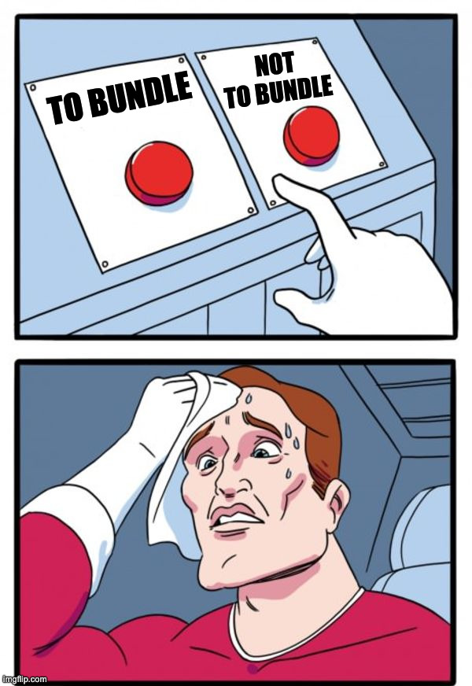

## Buckle up...

 

---

## I had a problem.

---

## How we bundle

- Javascript / CSS (webpack, Rollup, etc.) <!-- .element: class="fragment" -->
- Inline CSS / JS <!-- .element: class="fragment" -->
- data URLs in CSS <!-- .element: class="fragment" -->
- Inline SVGs <!-- .element: class="fragment" -->
- Sprites <!-- .element: class="fragment" -->
- Single Page Apps <!-- .element: class="fragment" -->
- Oversized REST Endpoints <!-- .element: class="fragment" -->
- GraphQL / GraphQL Client Batching <!-- .element: class="fragment" -->
- ... <!-- .element: class="fragment" -->
