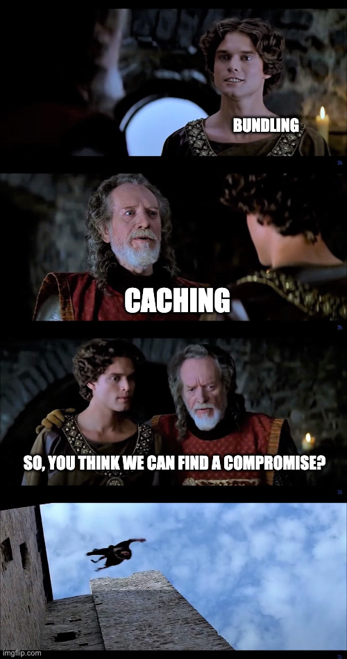

## How I move forward...

1. Bundling = Premature optimization <!-- .element: class="fragment" -->
2. H3 is faster, even when it's not its fast enough <!-- .element: class="fragment" -->

---

## The Point.

🛑 Bundling <!-- .element: class="fragment" -->

🚀 Optimizing for cache hit rates <!-- .element: class="fragment" -->

---

## Thank You

Data & source: [github.com/moonmeister/request-tax](https://github.com/moonmeister/request-tax)
